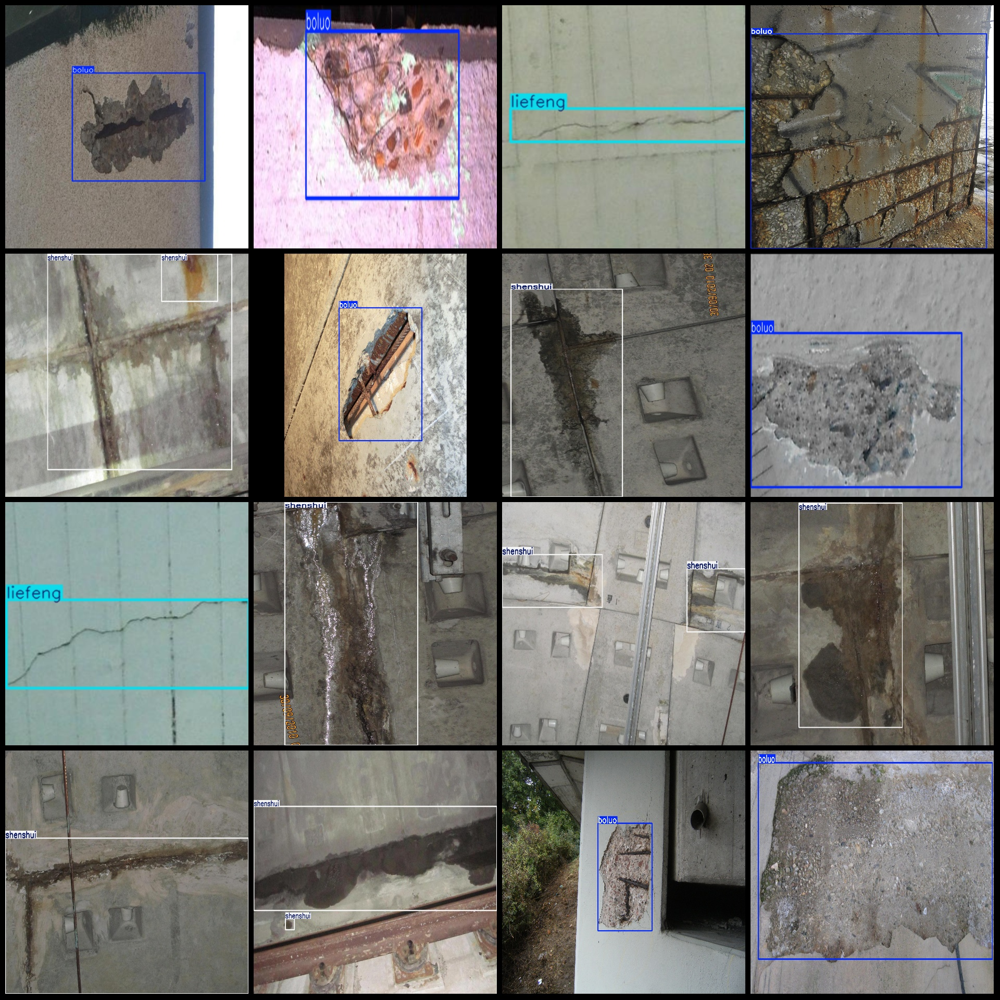
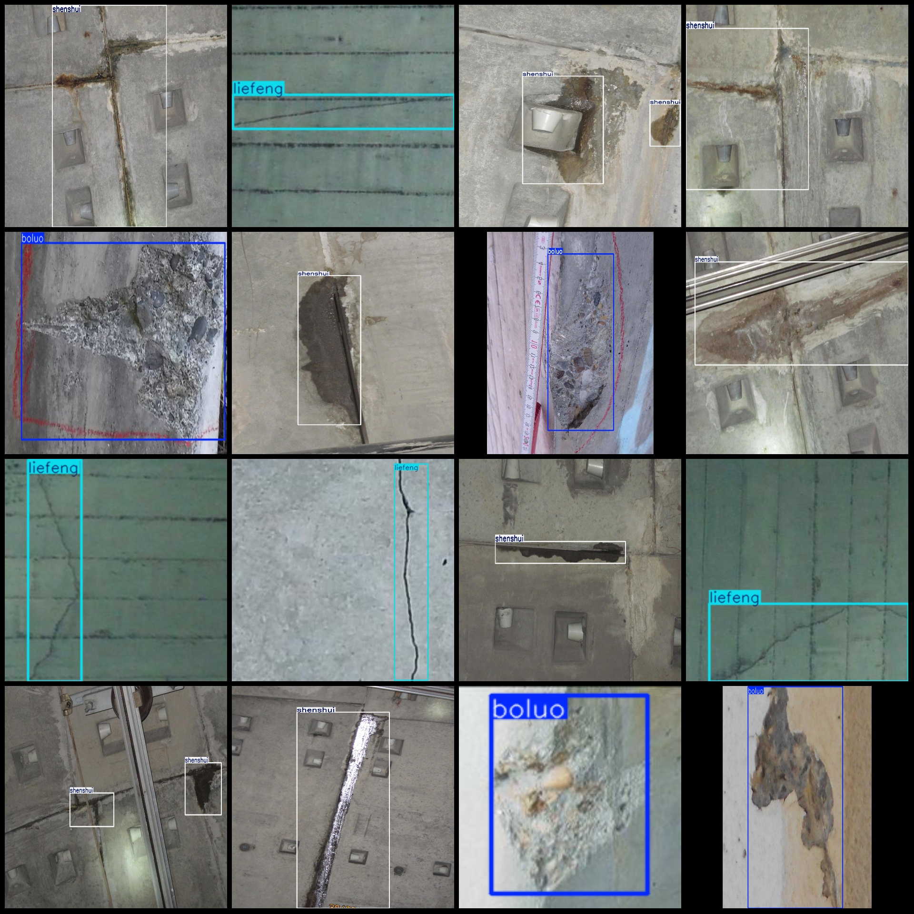

# Tunnel Crack Debris and Water Infiltration Detection Dataset VOC+YOLO Format: 3134 Images in 3 Categories

The dataset format: Pascal VOC format + YOLO format (without split path txt files, only containing jpg images along with the corresponding VOC format xml files and YOLO format txt files)
Number of images (number of jpg files): 3134
Number of annotations (number of xml files): 3134
Number of annotations (number of txt files): 3134
Number of categories: 3
Annotation category names (note that the order of categories in the YOLO format does not correspond to this, but is based on the labels folder "classes.txt"): ["boluo", "liefeng", "shenshui"]
Number of boxes per category:
- Boluo (debris) = 952 boxes
- Liefeng (crack) = 800 boxes
- Shenshui (water infiltration) = 2718 boxes
Total number of boxes: 4470
Image resolution: Multi-resolution images, such as 1944x2592, 2330x1747 etc.
Annotation tool used: labelImg
Annotation rules: Draw a rectangular box around each category.
Important note: There are no specific notes provided at this time.
Special notice: This dataset does not guarantee any precision in the accuracy of the trained models or weight files.
Image preview:  
Annotation examples:

## Images

Here is a pay link on Stripe ( https://buy.stripe.com/3cs8yP7sY87d0vu9AB ). Please contact me lonlonago@foxmail.com after funding $89, and I will send you a complete data files , thank you!

